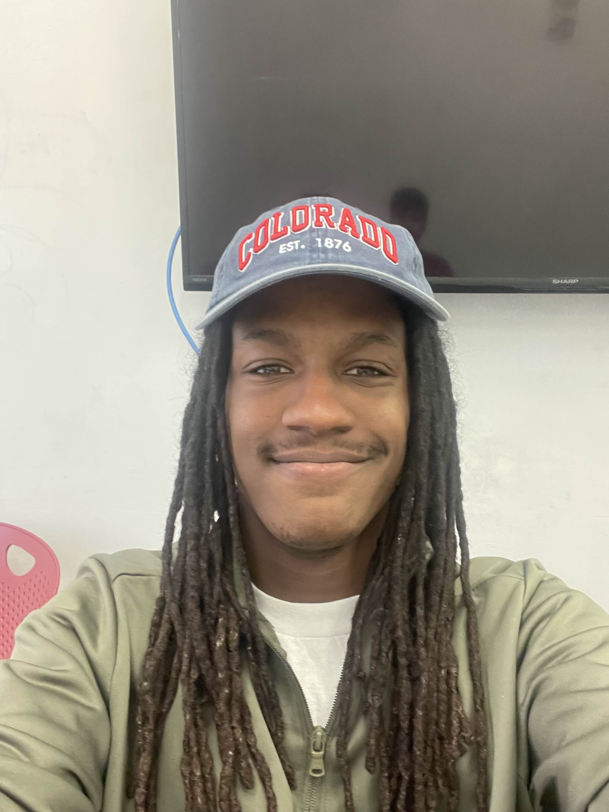
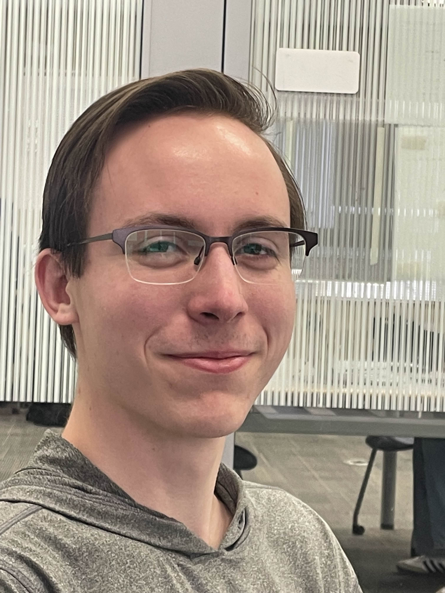
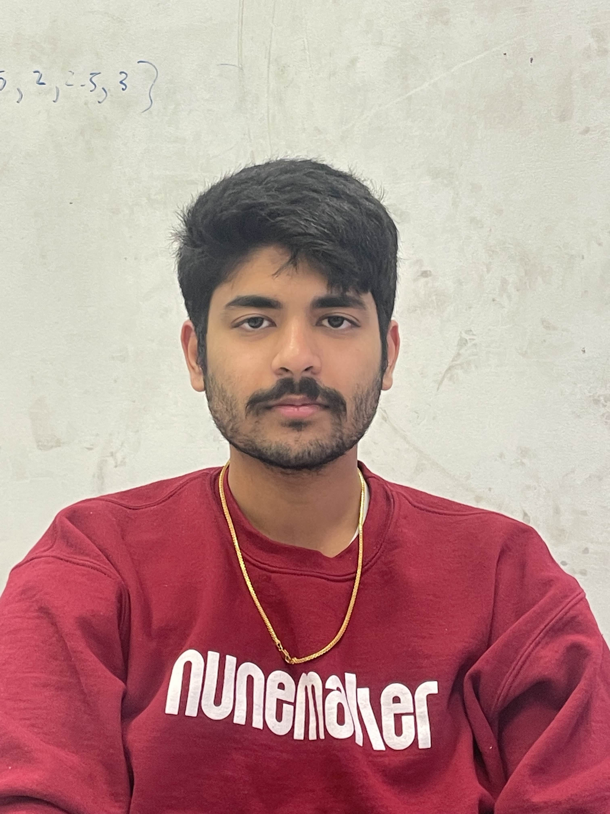
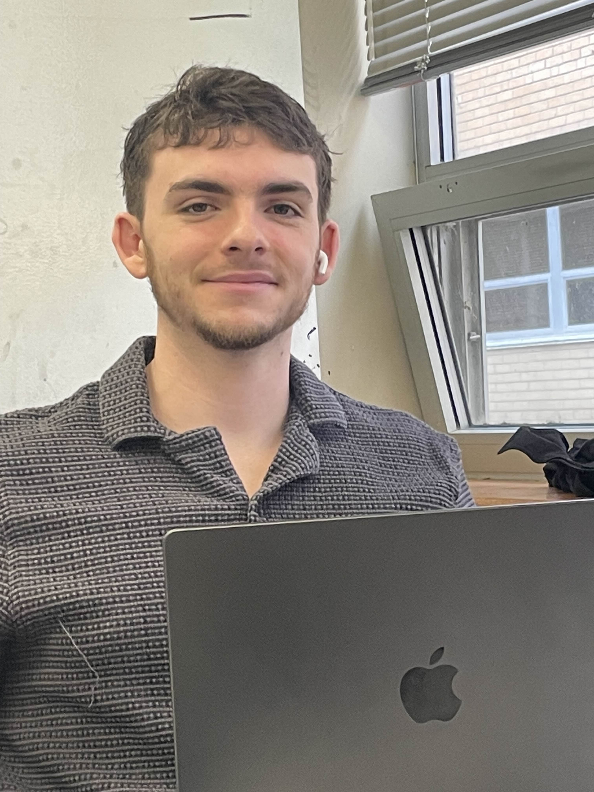

# EECS 447 Final Project Part 1

## Vision Statement
Libraries play an important role in facilitating interactions between members of a community. It is within the walls of library that individuals are able to: 
- Share knowledge through the use of Library Materials
- Provide third spaces to allow members of a community to meet up
- Host community events to better the lives of people in the community

Due to the importance of libraries within a community, it is imperative that the systems that libraries use are elegant, efficient, and scalable. In this project, we are tasked with providing this interface to allow for these interactions.

**Vision Statement**: The library management system will facilitate efficient interactions with library materials for members and staff. Team 19 pledges to ensure the following visions are met:
- The Library System shall provide an efficient interface for members to obtain, utilize, and/or return library inventory.
- The Library System shall provide an elegant interface for library staff to obtain a holistic view of all the resources that the library has to provide.
- The Library System shall provide an scalable interface for library administration to easily add resources that the library can provide.

Libraries are more than just a place to check out books. They are an essential in defining the characteristics of a community. Whether it a meetup with old K-12 friends or voting for the first time, some of the most meaningful interactions individuals people can have are libraries. The members of Team 19 want to create this project because we want to provide that "elegant, efficient, and scalable" interface that libraries can use to improve their productive. Being able to capture the essential characteristics and representing in an intuitive fashion allows libraries to provide for the members of their community without having to concern with inefficient and obsolete inventory-tracking mechanisms. We want libraries to only focus on providing for their community

***Team 19 recognizes that there have been many attacks on the autonomy of libraries as means of connection to the community. Team 19 condemns any actions taken to take advantage of the outreach that libraries have in their community. Team 19 strongly believes that libraries should be a location for discourse, not censorship.***

## Scope Statement
In accordance to the vision statement, the project will provide encompass the following features:
- Users
  - Searching for available items in inventory
  - Checking out/Returning library materials
  - Donating Library Materials
  - Reserving Library Community Rooms
  - Registering for a membership
  - Registering for community events
- Staff
  - Handling/Tracking membership status
  - Handling material check out/returns
  - Handling room reservations
  - Parsing donations
  - Posting Community Events

This project will not encompass the following features
- Users
  - TODO: Add Here
- Staff
  - TODO: Add Here

## Team Organization and Profiles
**Team Name:** DataBased

**Team Availability:** [Calendar](https://www.when2meet.com/?28738619-4W3Tl)

**Primary Contact:** James Hurd

**Team Administrator/Scrum Master:** James Hurd
- **Contact Info:** `jmh [at] ku [dot] edu`
- **Computing Platform Experience:** Linux, Windows, MacOS
- **Programming Knowledge:** Haskell, Rust, Bash

 

**Senior Tech Lead:** Dellie Wright
- **Contact Info:** `delsterone [at] gmail [dot] com`
- **Computing Platform Experience:** Linux, Windows, MacOS
- **Programming Knowledge:**

 

**Scope Management:** Evan Almloff
- **Contact Info:** `ealmlof1 [at] ku [dot] edu`
- **Computing Platform Experience:** Linux, Windows, MacOS
- **Programming Knowledge:** Rust, Python, Java, TypeScript

 

**Senior Enterprise Architect:** Manoj Turaga
- **Contact Info:** `manoj [dot] turaga [at] ku [dot] edu`
- **Computing Platform Experience:** Linux, Windows, MacOS
- **Programming Knowledge:** C, C++, Python, Java, C#, Racket

 

**Chief Archivist:** Drew Meyer
- **Contact Info:** `d216m596 [at] ku [dot] edu`
- **Computing Platform Experience:** Linux, Windows, MacOS
- **Programming Knowledge:** Python, SQL

## Project Meeting Log
**Reference File**: [020725](../Documentation/Meeting%20Logs/020725.md)

