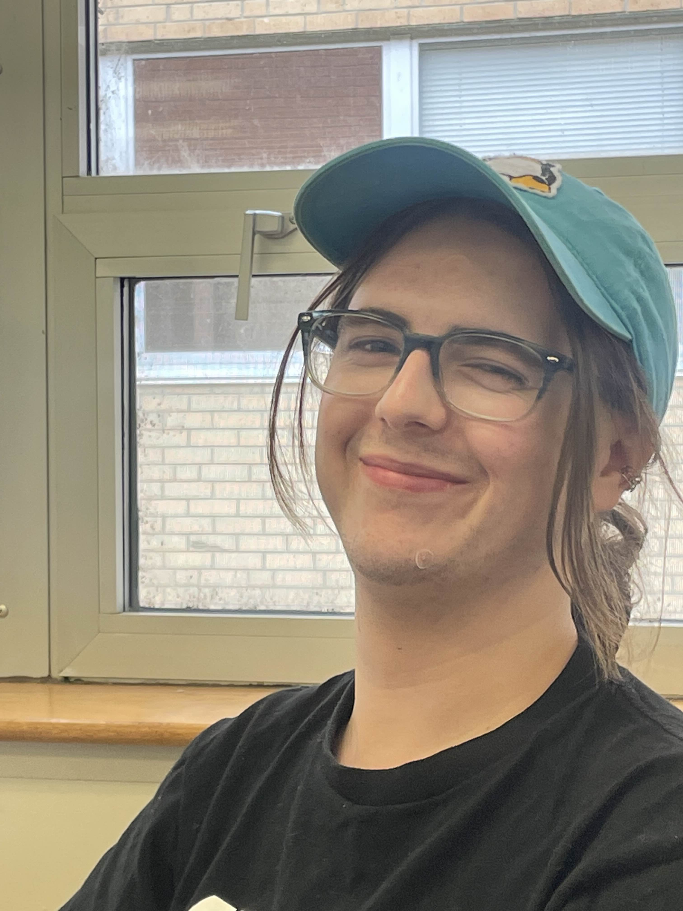

# Vision Statement
Libraries play an important role in facilitate interactions between members of a community. It is within the walls of libary that individuals are able to: 
- Share knowledge through the use of Library Materials
- Provide third spaces to allow members of a community to meet up
- Host community events to better the lives of people in the community

Due to the importance of libraries within a community, it is imperative that the systems that libraries use are 

# Scope Statement
The project will capture essential interactions between library staff and users. It will provide the following features to 

Manage items
Search items in the library
Check out and reserve items
Interface for members to check out, reserve, and return items
Interface for staff to add, organize, and update items
The database should manage the status of materials and track the status of user membership

# Team Organization and Profiles
**Team Name:** DataBased

**Team Availability:** [Calendar](https://www.when2meet.com/?28738619-4W3Tl)

**Primary Contact:** James Hurd

**Team Administrator/Scrum Master:** James Hurd
- **Contact Info:** `jmh [at] ku [dot] edu`
- **Computing Platform Experience:** Linux, Windows, MacOS
- **Programming Knowledge:** Haskell, Rust, Bash

 

**Senior Tech Lead:** Dellie Wright
- **Contact Info:** `delsterone [at] gmail [dot] com`
- **Computing Platform Experience:** Linux, Windows, MacOS
- **Programming Knowledge:**

 

**Scope Management:** Evan Almloff
- **Contact Info:** `ealmlof1 [at] ku [dot] edu`
- **Computing Platform Experience:** Linux, Windows, MacOS
- **Programming Knowledge:** Rust, Python, Java, TypeScript

 

**Senior Enterprise Architect:** Manoj Turaga
- **Contact Info:** `Manoj [dot] turaga [at] ku [dot] edu`
- **Computing Platform Experience:** Linux, Windows, MacOS
- **Programming Knowledge:** C, C++, Python, Java, C#, Racket

 

**Chief Archivist:** Drew Meyer
- **Contact Info:** `d216m596 [at] ku [dot] edu`
- **Computing Platform Experience:** Linux, Windows, MacOS
- **Programming Knowledge:** Python, SQL

# Project Meeting Log
**Reference File**: [020725](../Documentation/Meeting%20Logs/020725.md)

