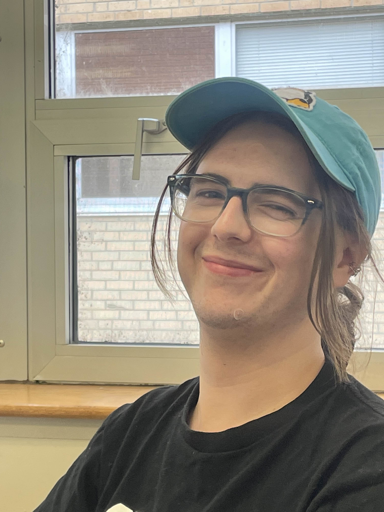
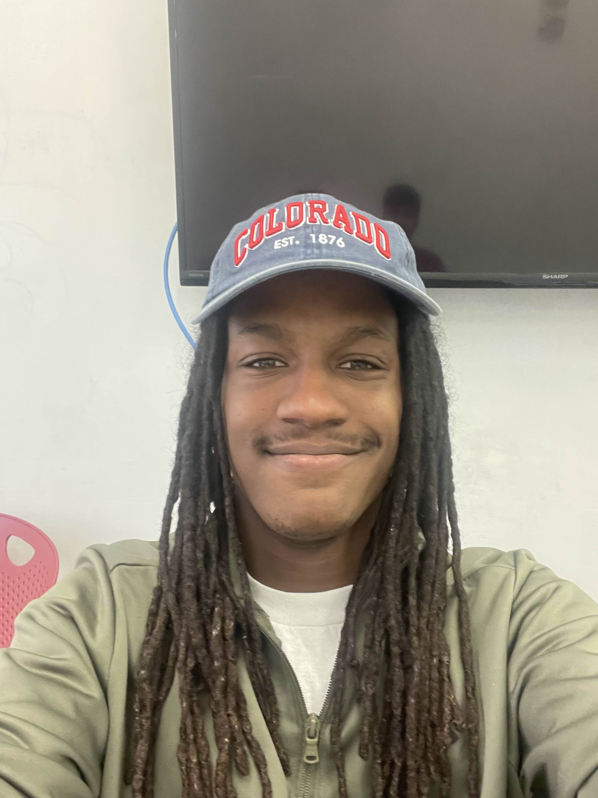
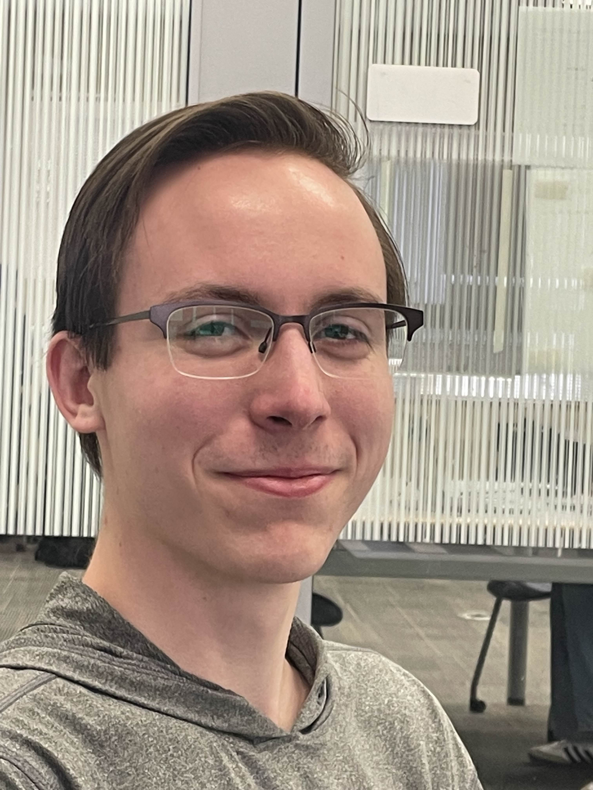
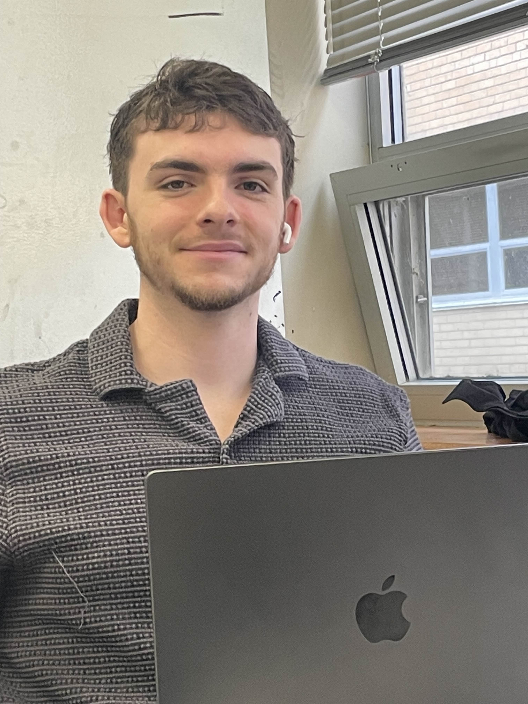
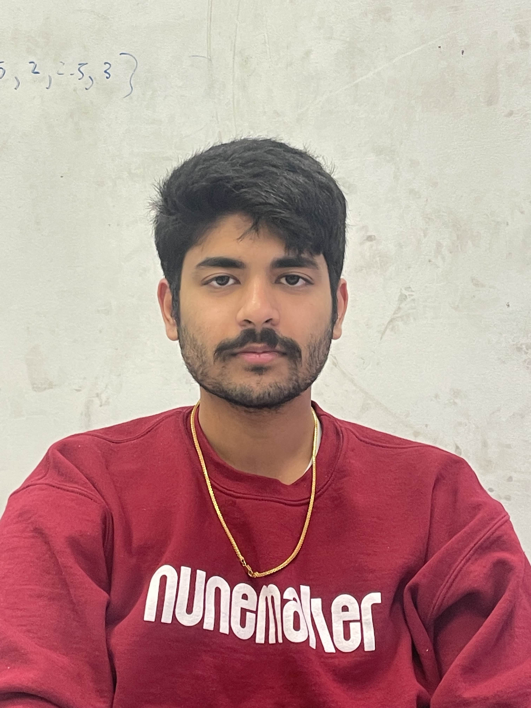

# First Meeting
- Date: February 15th, 2025
- Time: 3:00 PM - 4:00 PM
- Location: LEEP2 Study Room
- Objective: Project Vision/Plan
- Team Members Present: James, Dellie, Evan, Drew, Manoj

## Team Contacts & Roles
- James Hurd, Scrum Master (Team Admin) : `jmh [at] ku [dot] edu`

- Dellie Wright, Senior Tech Lead : `delsterone [at] gmail [dot] com` 

- Evan Almloff, Scope Mangement : `ealmlof1 [at] ku [dot] edu`

- Drew Meyer, Chief Archivist : `d216m596 [at] ku [dot] edu`

- Manoj Turaga, Senior Enterprise Architect : `Manoj [dot] turaga [at] ku [dot] edu`

## Tasks Allocated
- Hardware/Software requirements > Drew
- Functional requirements > James, Manoj
- Nonfunctional requirements > Evan
- Ancillary tasks > Dellie

## Task Completion Confirmation
No previous tasks allocated.

## GitHub Repository
https://github.com/dataBASED-eecs
